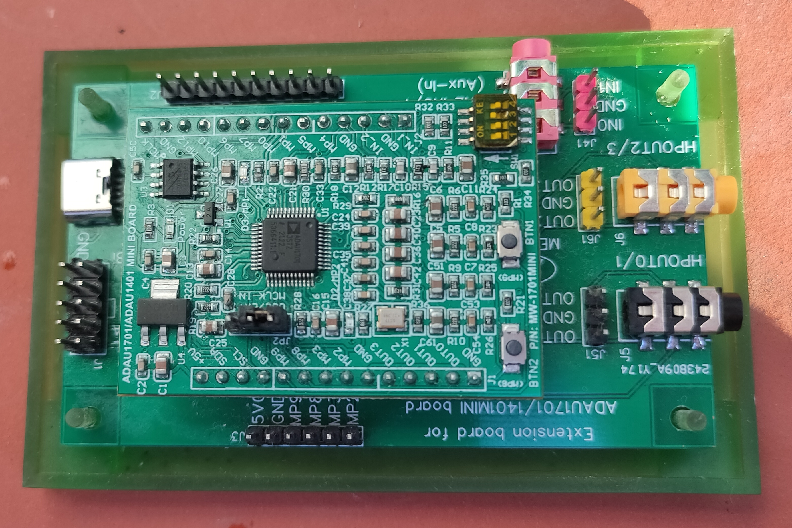

# 3d_models
.scad models renders (.png and .stl) automatically published in https://naelolaiz.github.io/3d_models/ by [github actions](https://github.com/naelolaiz/3d_models/actions).

# DSP ADAU1701 + extension board case
ADAU1701 + extension board PCB case (e.g.: https://es.aliexpress.com/item/1005002549648478.html)
## Bottom panel. V2

