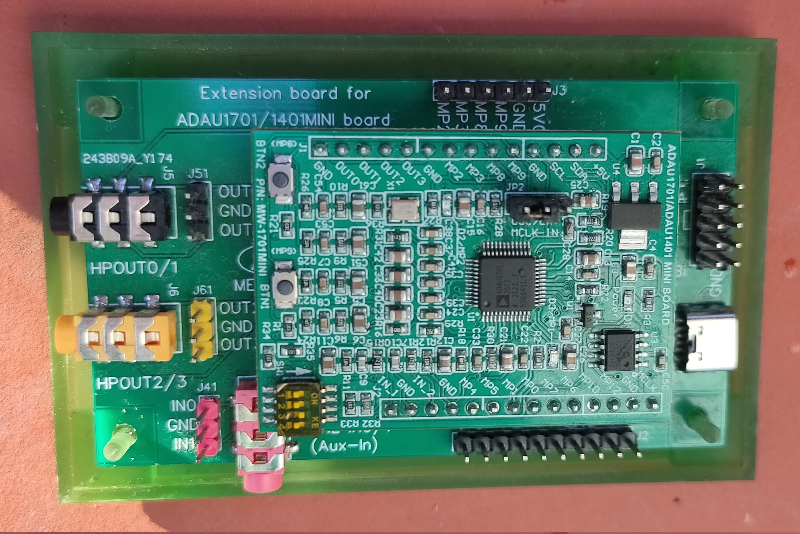
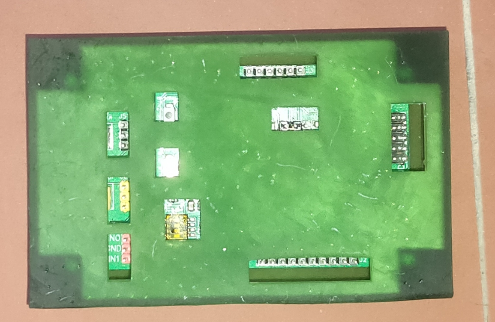
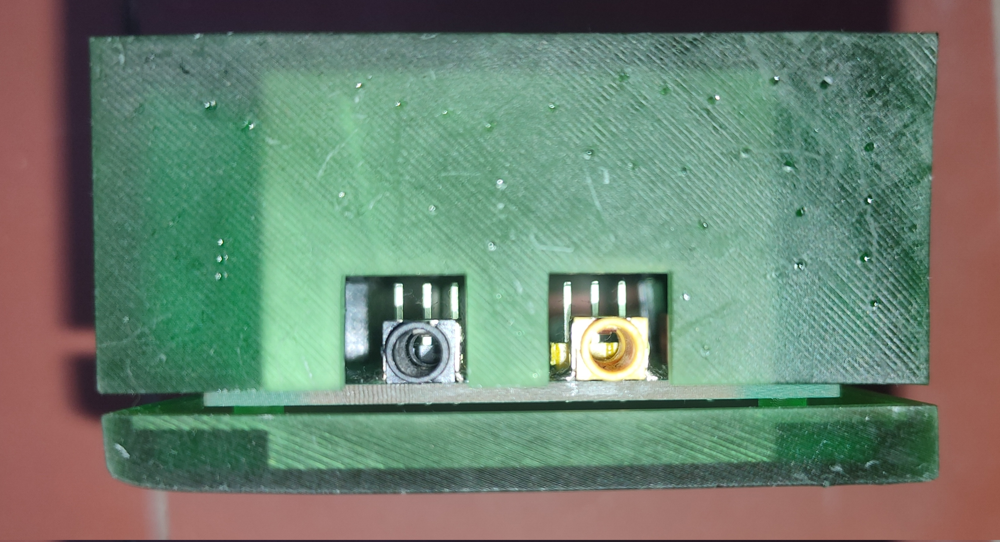
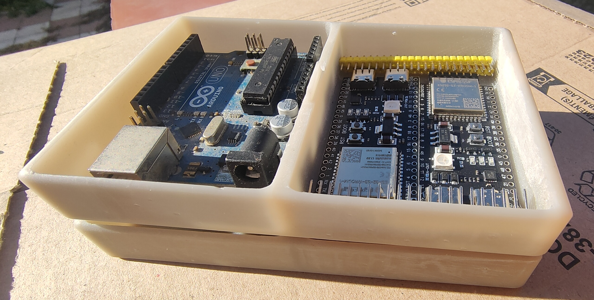

# 3D models
OpenSCAD 3D models 
## STL files 
STL files and PNG thumbnails available in [https://naelolaiz.github.io/3d_models](https://naelolaiz.github.io/3d_models)
### Automatic publishing
The STL and PNG are automatically rendered from the .scad files by [github actions](https://github.com/naelolaiz/3d_models/actions) (see [.github/woorkflows/main.yml](.github/workflows/main.yml) for more info).

# Current models:
 - [12V DC Motor support](DC_Motor_support)
 - [DSP ADAU1701 case](#dsp-adau1701--extension-board-case)
 - [Stackable box](#stackable-box)
 - [Stepper motor 45 degree mirror support](#stepper-motor-45-degree-mirror-support)

## DSP ADAU1701 + extension board case
ADAU1701 + extension board PCB case (e.g.: https://es.aliexpress.com/item/1005002549648478.html)

Project dir: [DSP_ADAU1701_case](DSP_ADAU1701_case)

### Bottom case. V2

### Top case. V1
(fixed already in current model)

## stackable box
Stackable boxes (size 126.48,80.72,23.36 mm, divided in two)

Project dir: [stackable_box](stackable_box)

### V1

## stepper motor 45 degree mirror support
For a galvanometer. 
To connect to a 5mm motor shaft.

Project dir: [stepper_motor_mirror_support](stepper_motor_mirror_support)

